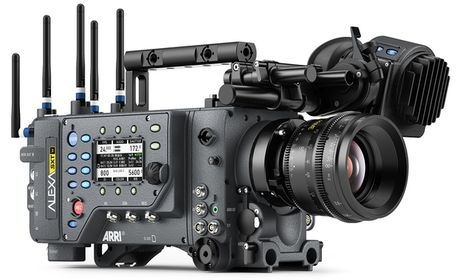
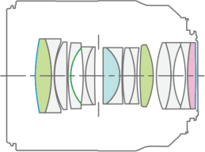
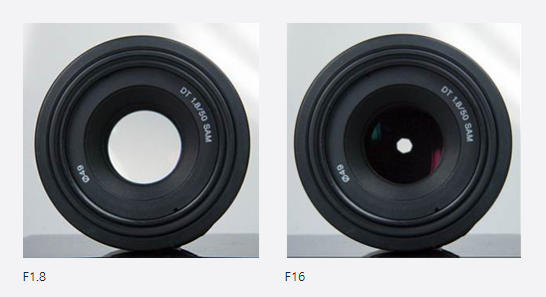
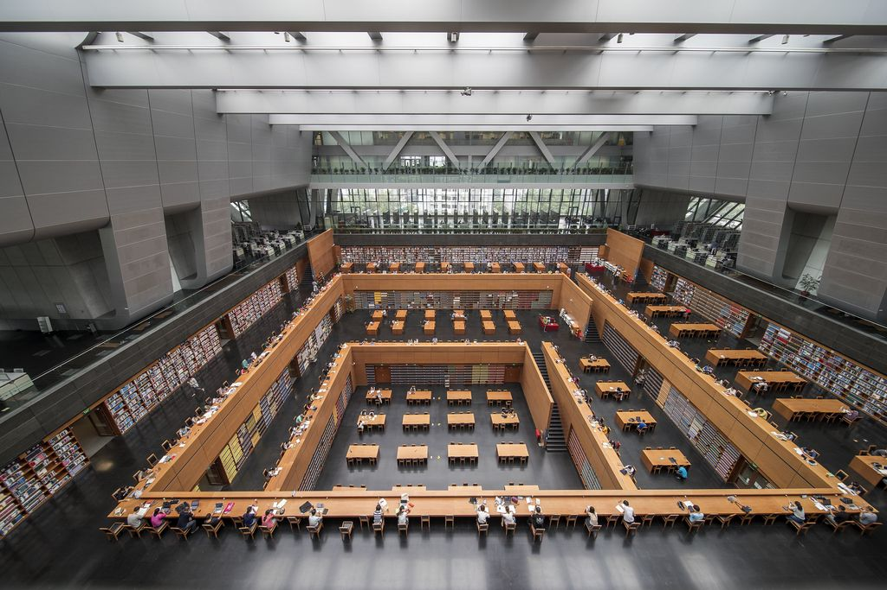
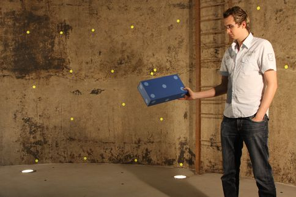

## 요약

- 교육기간: 4주 (주 1회)

- 1주차(2019.10.5 토, 13:00시 시작, 최대 5시간)
    1. 카메라 기초
    1. 영상 기초
    1. 하이퍼랩스 동영상 만들기
    
- 2주차(2019.10.12 토, 13:00시 시작, 최대 5시간)
    1. 카메라 심화(상)
    1. 매치무브 기초
    1. 매치무브 소프트웨어
    1. 3D이퀄라이져(3DEqualizer) 살펴보기
    1. 카메라 트래킹(기초)
    
- 3주차(2019.10.19 토, 13:00시 시작, 최대 5시간)
    1. 카메라 심화(하)
    1. 카메라 트래킹(심화)

- 4주차(2019.10.26 토, 13:00시 시작, 최대 5시간)
    1. 오브젝트 트래킹 이해
    1. 카메라 트래킹 + 오브젝트 트래킹
    
## 상세

### 1주차

- 교육전에 한번씩 보고 오세요 :)
    - [한 눈에 쏙, 렌즈 이야기 (카메라의 역사) - 빠르크의 3분 강좌](https://youtu.be/-Y4YZlEQafs)
    - [꾸러기 탐구생활-핀홀카메라(111회) 상](https://youtu.be/ZHAm0dMkoug) , [꾸러기 탐구생활-핀홀카메라(111회) 하](https://youtu.be/bUHdoCdTioI) - SBS Culture
    - [DSLR, 미러리스 카메라 조작. 이 영상 하나로 끝내버리기 - 비됴클래스](https://youtu.be/xgx8jMrGARg)

1. 카메라 기초
    1. 카메라 역사
    1. 카메라 종류
        - DSLR
        - 미러리스(Mirrorless)
        - 컴팩트(Compact)
        - 필름(Film)
        - 시네마(Cinema)
            > 
            >  [ALEXA SXT W - Arri](https://www.arri.com/en/camera-systems/cameras/alexa-sxt-w)
    1. 카메라 구조
        1. [렌즈](https://youtu.be/dg3kIKphB5E)
            - 카메라의 눈.
            - 렌즈를 통해 카메라 안으로 빛이 들어온다.
            - ~군 ~매. 렌즈에 사용된 개별 유리의 갯수를 매, 매의 묶음을 군이라 한다.
                > 
                >  RF50mm F1.2 L USM - 9군 15매
                >  [eos digital - Canon Global](https://global.canon/en/imaging/l-lens/line-up/rf50mm_usm.html)
        2. 바디
            - 이미지 센서 또는 필름에 둥근 상(Image Circle, 이미지 서클)이 맺힌다.
                > 
                >  [Image circle - Wikipedia](https://en.wikipedia.org/wiki/Image_circle)
            - 이미지 센서는 빛을 디지털 신호로 바꿔서 이미지 파일을 만들어 낸다.
    1. 셔터 스피드 & ISO & 조리개
        > 
        1. [셔터 스피드(Shutter Speed)](https://support.d-imaging.sony.co.jp/support/ilc/learn/ko/knowledge/09.html)
            - 이미지 센서 앞쪽의 셔터가 열려 있는 시간
                - 1": 필름 또는 센서가 1초 동안 빛에 노출 됨
                - 1/100: 필름 또는 센서가 100 분의 1초 동안 빛에 노출 됨
                - 1/1000: 필름 또는 센서가 1000 분의 1초 동안 빛에 노출 됨
            - 셔터 스피드가 느릴수록 사진이 밝아짐. 센서가 빛에 더 오래 노출되어서.
            - 하지만 셔터 스피드가 느릴수록 잔상(Motion Blur, 모션블러)이 생김.
            - 바디에서 제어
            - `느린 셔터 스피드를 사용해야 하는 상황에서는 삼각대(Tripod)가 필수. 멋으로 들고 다니는 물건이 아니다.`
        1. ISO
            - 렌즈를 통해 들어오는 광량을 증폭시키는 정도 (필름은 ISO가 고정)
            - ISO가 높을수록 사진이 밝아짐. 센서가 빛에 더 민감하게 반응해서.
            - 하지만 ISO가 높을수록 사진 사진에 노이즈(Noise)가 많이 생김.
            - 바디에서 제어
        1. [조리개(Aperture, 애퍼처)](https://support.d-imaging.sony.co.jp/support/ilc/learn/ko/knowledge/06.html)
            > 
            >  [Sony Global - 디지털 이미징](https://support.d-imaging.sony.co.jp/support/ilc/learn/ko/knowledge/06.html)
            - 렌즈를 통해 들어오는 광량을 조절.
            - 조리개 값이 낮을수록 사진이 밝아짐. 같은 시간에 센서가 더 많은 양의 빛에 노출되어서.
            - 하지만 조리개 값이 낮을수록 심도가 얕아진다. 
                > 
                >  [Sony Global - 디지털 이미징](https://support.d-imaging.sony.co.jp/support/ilc/learn/ko/knowledge/03.html)
            - 렌즈에서 제어
            
    1. 초점(Focus, 포커스) & 피사계 심도(Depth of Field, 뎁스 오브 필드)
        - 포커스 링(Focus Ring)을 통해 초점을 조정.
        - [포커스 이동(Rack Focus, 랙 포커스)](https://youtu.be/lqE_CG9lnBs)
        - 섈로 포커스(Shallow Focus)
            - 한 층은 선명한 초점이 형성되나 그 배경과 주변은 뿌옇게 탈초점 상태로 만드는 촬영 기법
            - 심도가 얕다(Shallow)
            > 
            >  [Shallow focus - Wikipedia](https://en.wikipedia.org/wiki/Shallow_focus)          
        - 딥 포커스(Deep Focus)
            - 클로즈업에서 무한대에 이르기까지 모든 곳의 초점을 분명하게 맞추는 촬영 기법
            - 심도가 깊다(Deep)
            > 
            >  [Venus Optics Laowa](https://www.flickr.com/photos/137268551@N02/28005366633/in/album-72157669943654560/)
            
    1. [초점거리(Focal Length, 포컬랭스)](https://support.d-imaging.sony.co.jp/support/ilc/learn/ko/knowledge/01.html)
        - [렌즈의 제2주점 부터 촬상면(센서 또는 필름) 까지의 거리.](https://guzene.tistory.com/147)
        - 단위: mm(밀리미터). ex) 8mm, 35mm, 100mm.
        - 초점거리가 길다 = 배율이 높다 = 화각이 좁다
        - 초점거리가 짧다 = 배율이 낮다 = 화각이 넓다
        - [포컬랭스 시뮬레이션](https://imaging.nikon.com/lineup/lens/simulator/)
        - `포커스 디스턴스(Focus Distance)와 혼동하지 말 것. 카메라부터 피사체 까지의 거리.`
        
    1. [줌(Zoom)](https://youtu.be/mRp13pRzzWQ)
        - 포컬랭스를 변화 시키는 것.
            - 줌 인(Zoom In) - 포컬랭스를 늘리는 것. ex) 24mm >> 75mm
            - 줌 아웃(Zoom Out) - 포컬랭스를 줄이는 것. ex) 74mm >> 24mm
        - 줌 렌즈에서만 가능. 단 렌즈는 줌 기능이 없다.
        - 줌 링(Zoom Ring)을 통해 조정

1. [영상 기초](https://youtu.be/ZKmNUP_5TFQ)
    - 영상: 이미지(Image). 정지 사진(Still Picture).
        > 
        >  [Eadweard Muybridge - Wikipedia](https://en.wikipedia.org/wiki/Eadweard_Muybridge)
    - 동영상: 시간상 연속된 정지 사진들의 모음. 마치 움직이는 듯한 느낌의 착각.
        > 
        >  [Eadweard Muybridge - Wikipedia](https://en.wikipedia.org/wiki/Eadweard_Muybridge)
    1. 화소(Pixel, 픽셀)
        - 이미지를 구성하고 있는 최소 단위
            > 
            >  [Pixel - Wikipedia](https://en.wikipedia.org/wiki/Pixel)
    1. 이미지 사이즈
        - 표기법: <가로줄 픽셀개수> × <새로줄 픽셀개수>
        - 6000 × 4000 , 1920 × 1080
    1. 해상도
        - 이미지의 픽셀개수
        - 1920 × 1080 = 2,073,600
    1. 종횡비(Aspect Ratio)
        - <가로> ÷ <새로>
        - 이미지 종횡비(Image Aspect Ratio)
            - 6000 ÷ 4000 = 1.5
            - 1920 ÷ 1080 = 1.778
        - 픽셀 종횡비(Pixel Aspect Ratio)
            - 1 ÷ 1 = 1
    1. [프레임 레이트(Frame Rate)](https://namu.wiki/w/FPS)
        - 초당 프레임 수(FPS, Frames Per Second)
        - [103,000 FPS](https://youtu.be/qQKhIK4pvYo?t=221)
    1. [이미지 파일 형식(Image file formats)](https://ko.wikipedia.org/wiki/이미지_파일_형식)
        - 많이 쓰는 확장자 - jpg , png , dpx , exr 등 
        - [Raw 이미지 포맷](https://ko.wikipedia.org/wiki/Raw_이미지_포맷)
    1. 이미지 시퀀스(Image Sequence) & 비디오 파일(Video File)
        - 이미지 시퀀스
            - 낮장으로 이루어진 연속적인 이름을 가진 이미지 파일
            - <네임(Name)>.<패딩(Padding)>.<확장자(Extention)>
            - my_video.0001.jpg , my_video.0002.jpg , my_video.0003.jpg ...
        - 비디오 파일
            - 이미지 시퀀스를 단일 파일로 압축한 파일.
            - 많이 쓰는 확장자 - mp4 , mov 등
        - CG툴(Autodesk Maya, 3DEqualizer 등)은 보통 이미지 시퀀스 친화적. 반대로, 편집툴(Premiere Pro, Final Cut Pro)은 비디오 파일 친화적.
     
1. [하이퍼랩스(Hyperlapse) 동영상](https://upload.wikimedia.org/wikipedia/commons/9/98/Brisbane_Hyperlapse_2013_%28trimmed%29.ogv) 만들기
    - 하이퍼랩스란? [타임랩스(Time Lapse) 동영상](https://youtu.be/_Ecxt_W96x0) + 움직임(Movement)
    - 5초(30fps) 영상 만들 것. 사진 150장(30장 × 5초).
    - 촬영한 사진들로 이미지 시퀀스(Image Sequence) 만들기
        - XnViewMP로 리네이밍(Renaming)
        - [XnViewMP Download Page Link](https://www.xnview.com/en/xnviewmp/)
    - 'DJV Imaging'으로 이미지 시퀀스 재생하기
        - [DJV Imaging Download Page Link](http://djv.sourceforge.net/Download.html)
    - 'DJV Imaging'으로 비디오 파일 만들기
        - File >> Export Seqeunce

### 2주차

1. 카메라 심화
    - 초점거리(Focal Length, 포컬랭스)
        - [렌즈의 제2주점 부터 촬상면(센서 또는 필름) 까지의 거리.](https://guzene.tistory.com/147)
        - 단위: mm(밀리미터). ex) 8mm, 35mm, 100mm.
        - 초점거리가 길다 = 배율이 높다 = 화각이 좁다
        - 초점거리가 짧다 = 배율이 낮다 = 화각이 넓다
        - 포커스 디스턴스(Focus Distance)와 혼동하지 말 것. 카메라부터 피사체 까지의 거리.
    - 필름백(Film Back)
        - !!! 센서 사이즈 ≠ 필름백 사이즈 !!!
        - 표기법: (필름백 가로) × (필름백 새로)mm. 예) 36 × 24mm. 'mm(미리미터)' 또는 'inch(인치)' 사용.
        - 카메라는 사진을 만들때 센서(또는 필름)의 전체 또는 일부분만 사용한다. 이때 촬영시 사용한 센서의 영역(Effective Sensor Area)이 필름백 사이즈다.
        - 필름백이 크다 = 배율이 낮다 = 화각이 넓다
        - 필름백이 작다 = 배율이 높다 = 화각이 좁다
    - 화각(Angle of View, 앵글 오브 뷰)

1. 매치무브 기초
    - 매치무브 이해
        1. What? 3D to 2D & 2D to 3D
        1. Why? CG요소를 실촬영본에 배치하고자 할때(그 반대도) 매치무브 작업은 필수다. 
        1. Who? Matchmove Artist, Matchmover, Integration Artist
        1. How?
            - 손으로(By Hand)
            - [MCC(Motion Control Camera)](https://youtu.be/UIwdCN4dV6w)
            - Matchmove Software(3DEqualizer, PFTrack, Syntheyes 등)
    - 매치무브 작업 과정
        1. 푸티지 평가 (Evaluating the Footage)
            - 원본 푸티지(Raw Footage)?
            - 매치무브 소프트웨어를 사용할까? 손으로 잡을까?
        1. 정보 적용 (Applying Information)
            - 촬영장 실측 (Set Measurements)
            - Survey Data
        1. 카메라 규정하기 (Define the Camera)
            - 카메라 내부 파라미터: 포컬랭스(Focal Length), 필름백(Film Back) 등
            - 카메라 외부 파라미터: 위치(Translation 또는 Position), 회전(Rotation 또는 Orientaion)
        1. 셋 피팅 (Set Fitting)
        1. 테스트 (Testing)
        1. 딜리버 (Delivering the Scene)
    - 매치무브와 파이프라인
        - 프로덕션(Production)과 포스트 프로덕션(Post Production)을 이어주는 다리 역할.
        - 포스트 프로덕션 파이프라인 첫 단추.
    - 퍼스펙티브 매칭(Perspective Matching) 연습
        - 매치무브 소프트웨어를 사용하지 않고 **Maya에서 손으로 카메라의 위치를 찾는 연습**. 한장.
        - 3D 카메라를 생성하고, 초점거리(Focal Length) & 필름백(Film Back) 값 적용하기.
            - Focal Length: 16mm
            - Film Back: 18 × 12mm
        - 3D 카메라에 잘못된 정보가 들어갔을 때 결과 살펴보기.

1. 매치무브 소프트웨어
    - 사진측량 이해
        - Photogrammetry(포토그래미트리) = Photos(빛) + Grama(형상) + Metry(재다)
        - 사진들로부터 물체를 측정하는 기술.
        - 시차(Parallax)
            - 관측자가 어떤 물체를 동시에 두 지점에서 보았을 때 생기는 방향의 차.
                1. 왼쪽눈은 감고 오른쪽 눈은 뜬다.
                1. 오른손 엄지로 오른쪽 눈 앞을 가린다(1~2센치 정도 거리를 둔다). 
                1. 오른쪽 눈을 감고 왼쪽 눈을 뜬다.
                1. 오른손 엄지는 움직이지 않았지만, 관측자 입장에선 오른손 엄지가 오른쪽으로 이동한 것 처럼 보인다. 이것이 시차다. 
                - 관측자 쪽에 가까운 물체일수록 시차가 크게 발생한다.
            - 사람은 2D 비디오만 봐도 카메라의 궤적과 3D 공간을 어느정도 유추 할 수 있다. 시차를 이해하고 있기 때문.
    - 요약 
        - 입력(Input) - 사진(두장 이상) + 초점거리 + 필름백 + 이미지간 대응점(2D Point)
        - 출력(Output) - 카메라들의 위치 & 회전 + 3D Points

1. 3DEqualizer 살펴보기
    1. 윈도우(Windows)
    1. 컨트롤(Controls)
    1. 설정(Preference)
    1. 커스텀 UI

1. 카메라 트래킹 (기초)
    1. 카메라 트래킹 in 3DEqualizer
        1. 이미지 불러오기(import)
            - 레퍼런스 카메라(Reference Camera)
        1. Attribute Editor에 정보 입력하기
            - Focal Length: 24mm
            - Film Back: 36 × 24mm
        1. 2D Point Tracking
            - 디폴트 세팅으로 솔브를 하기 위해 프레임당 최소 6개의 2D 포인트가 필요.
        1. 솔빙 & 정렬 & 스케일(Solving & Orienting & Scaling)
            - 정렬
                - 바닥 포인트들을 XZ Plane에 정렬
            - 스케일
                - 디스턴스 컨스트레인트(Distance Constraint)
        1. 내보내기(Export)
            - Export Maya Scene(.mel)
            
    1. 카메라 트래킹 in Maya
        1. MEL 스크립트 불러오기(Import MEL Script)
            - 소스 스크립트(Source Script) or 드래그 앤 드롭(Drag and Drop)
        1. 셋 피팅
            - 더미 모델링
        1. 테스트
            - 플레이블래스트(Playblast)        
        1. CG요소 렌더링(Rendering CG Elements)
            - 렌더 사이즈 - 원본 푸티지 사이즈(Raw Footage Size)
            - Viewport2.0 플레이블라스트
    1. 합성

### 3주차

1. 카메라 심화
    - 렌즈 디스토션(Lens Distortion)

1. 카메라 트래킹 (심화)
    1. 카메라 트래킹 in 3DEqualizer
        1. 이미지 불러오기(import)
            - 시퀀스 카메라(Sequence Camera)
            - 파일: trackboy
                > 
                >  [Science D Vision](https://www.3dequalizer.com)
        1. 어트리뷰트 에디터(Attribute Editor)에 정보 입력하기
            - 메타데이터(Metadata) 확인하기
            - Camera: Canon EOS 40D
            - Focal Length: 24mm
            - Film Back: ? × ?mm
        1. 2D Point Tracking
            - Manual Tracking Controls(F2)
            - Basic Hotkeys
                - <kbd>t</kbd>: Track all frames
                - <kbd>,</kbd>,<kbd>.</kbd>: Track backward 1 frame, Track forward 1 frame
                - <kbd>e</kbd>: Start Point & End Point
                - <kbd>ctrl + r</kbd>: Remove Keyframe
        1. 솔빙 & 정렬 & 스케일(Solving & Orienting & Scaling)
        1. 파라미터 조정(Parameter Adjustment)
        1. 내보내기(Export)
            - Export Maya Scene(.mel)
            - Export Nuke Lens Distortion Node(.nk)
            - Export Undistort(Dewarped) Plate
                - Overscan
            
    1. 카메라 트래킹 in Maya
        1. MEL 스크립트 불러오기(Import MEL Script)
            - 소스 스크립트(Source Script) or 드래그 앤 드롭(Drag and Drop)
        1. 오버스캔 보정(Overscan Compensation)
        1. 정렬 & 스케일
        1. 셋 피팅
            - 바닥 모델링
            - 벽 모델링
            - 사다리 모델링
                - 삼각 측량(Triangulation, 트라이앵귤레이션)
        1. 테스트
            - 플레이블래스트(Playblast)
        1. 딜리버
            - 아웃라이너 정리하기
            - 베이킹(Baking)
                - 키 프레임(Key Frame)이 들어가있고 페어런트(Parent) 되어있는 오브젝트를 월드 스페이스(World Space)로 꺼내는 것.
        1. CG요소 렌더(Render CG Elements)
            - 렌더 사이즈 - 오버스캔 사이즈
            
    1. 합성하기
        
### 4주차

1. 오브젝트 트래킹(Object Tracking) 이해
    - 오브젝트 트래킹을 단독으로 진행하면 안되는 이유.
    
1. 카메라 트래킹 + 오브젝트 트래킹 in 3DEqualizer     
    1. 카메라 트래킹
        - 3주차 프로젝트 파일(.3de) 열기
    1. 오브젝트 트래킹
        1. 포인트 그룹(Point Group) 이해
            - 카메라 트래킹 - 카메라 포인트 그룹
            - 오브젝트 트래킹 - 오브젝트 포인트 그룹
        1. 2D Point Tracking
        1. 솔빙 & 스케일
        1. 파라미터 조정(Parameter Adjustment)
        1. 내보내기(Export)
            - Export Maya Scene(.mel)
            - Export Nuke Lens Distortion Node(.nk)
            - Export Undistort(Dewarped) Plate

    1. 카메라 트래킹 + 오브젝트 트래킹 in Maya
        1. MEL 스크립트 불러오기(Import MEL Script)
            - 소스 스크립트(Source Script) or 드래그 앤 드롭(Drag and Drop)
        1. 오버스캔 보정(Overscan Compensation)
        1. 정렬 & 스케일
        1. 셋 피팅
            - 바닥 모델링
            - 벽 모델링
            - 사다리 모델링
                - 삼각 측량(Triangulation, 트라이앵귤레이션)
            - 박스 모델링
        1. 테스트
            - 플레이블래스트(Playblast)
        1. 딜리버
            - 아웃라이너 정리하기
            - 베이킹(Baking)
        1. CG요소 렌더(Render CG Elements)
            - 렌더 사이즈 - 오버스캔 사이즈
            
    1. 합성하기
